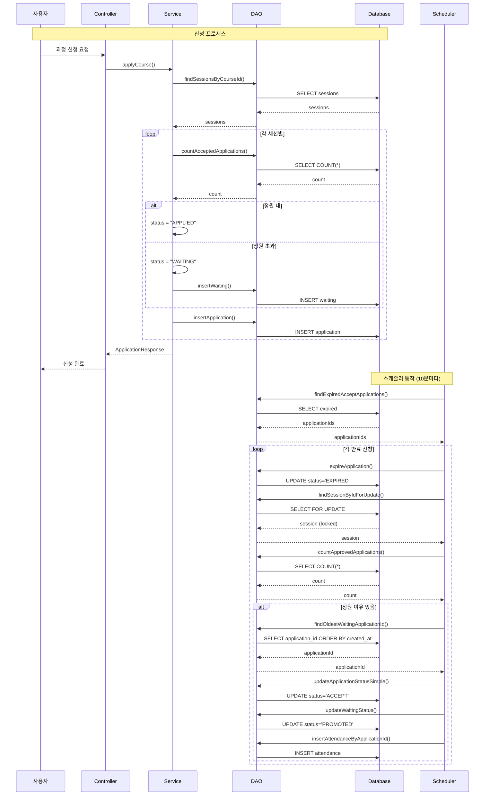
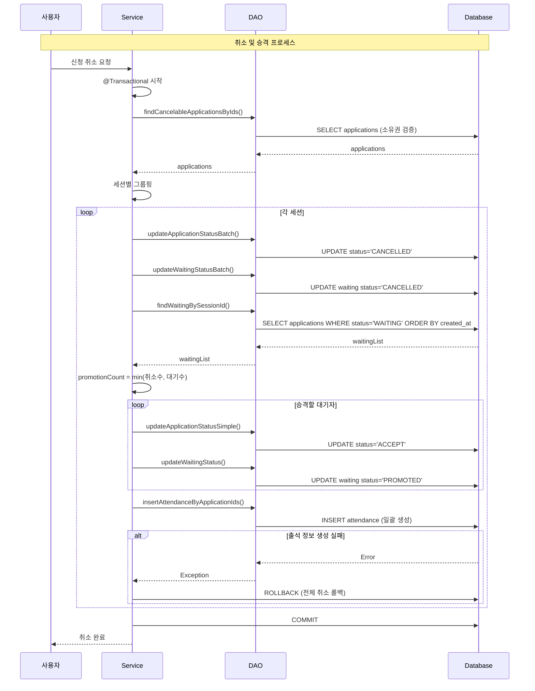
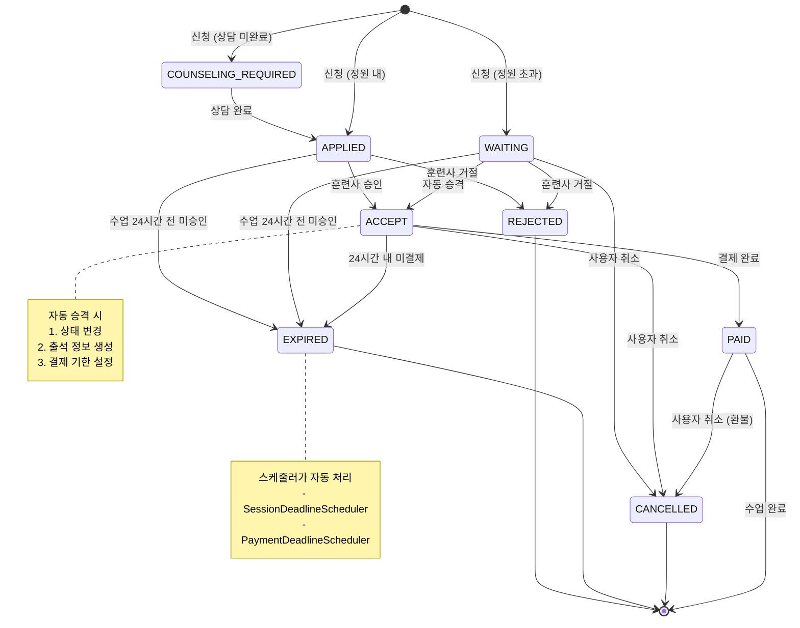

# 훈련 과정 신청 시스템 - 스케줄러 & 대기열 기술 문서

## 📋 목차
1. [시스템 개요](#시스템-개요)
2. [스케줄러 시스템](#스케줄러-시스템)
3. [대기열 시스템](#대기열-시스템)
4. [기술 스택](#기술-스택)
5. [동시성 제어](#동시성-제어)
6. [데이터 흐름도](#데이터-흐름도)

---

## 🎯 시스템 개요

### 비즈니스 요구사항

#### 1. 자동 상태 관리
- **세션 마감**: 수업 시작 24시간 전 미승인 신청 자동 만료
- **결제 마감**: 승인 후 24시간 내 미결제 시 자동 만료 및 대기자 승격
- **과정 상태**: 진행 중/종료 자동 업데이트

#### 2. 대기열 관리
- **정원 초과 시**: WAITING 상태로 순번 관리
- **취소 발생 시**: 대기 순번에 따라 자동 승격
- **미리 승인**: 훈련사가 특정 대기자를 미리 승인 가능

#### 3. 신청 상태 전이
```
COUNSELING_REQUIRED → APPLIED → ACCEPT → PAID
                                   ↓
                              WAITING (정원 초과)
                                   ↓
                              ACCEPT (승격)
```

---

## ⚙️ 스케줄러 시스템

### 1. 전체 아키텍처

```
┌─────────────────────────────────────────┐
│         Spring Scheduler                │
│   (@Scheduled - Cron Expression)        │
└────────────┬────────────────────────────┘
             │
    ┌────────┴──────────┬─────────────┐
    │                   │             │
    ▼                   ▼             ▼
┌─────────┐      ┌─────────┐   ┌─────────┐
│Session  │      │Payment  │   │Course   │
│Deadline │      │Deadline │   │Status   │
│Scheduler│      │Scheduler│   │Scheduler│
└────┬────┘      └────┬────┘   └────┬────┘
     │                │             │
     ▼                ▼             ▼
┌─────────┐      ┌─────────┐   ┌─────────┐
│Service  │      │DAO      │   │Service  │
│Layer    │      │Layer    │   │Layer    │
└─────────┘      └─────────┘   └─────────┘
```

### 2. 스케줄러 상세 설명

#### 2.1 SessionDeadlineScheduler (수업 시작 마감)

**목적**: 수업 시작 24시간 전에 미승인 신청을 자동으로 만료 처리

**실행 주기**:
```java
@Scheduled(cron = "0 0/10 * * * *")  // 10분마다 (정시 시작)
// 00:00, 00:10, 00:20, 00:30, 00:40, 00:50
```

**처리 플로우**:
```java
@Scheduled(cron = "0 0/10 * * * *")
public void processSessionDeadline() {
    // 1. 기능 활성화 체크
    if (!sessionDeadlineEnabled) return;
    
    // 2. 서비스 레이어 호출 (트랜잭션 분리)
    sessionDeadlineService.processSessionDeadline(sessionDeadlineHours);
}
```

**서비스 로직**:
```java
@Transactional
public void processSessionDeadline(int sessionDeadlineHours) {
    // 1. 마감 시간이 지난 신청 조회
    List<Long> expiredApplicationIds = 
        trainingSessionDAO.findApplicationsPastSessionDeadline(sessionDeadlineHours);
    
    // 2. 일괄 EXPIRED 처리
    applicationDAO.updateApplicationStatusBatch(expiredApplicationIds, "EXPIRED");
}
```

**SQL 쿼리**:
```sql
SELECT tca.application_id
FROM training_course_application tca
JOIN training_session ts ON tca.session_id = ts.session_id
WHERE tca.status IN ('APPLIED', 'COUNSELING_REQUIRED', 'WAITING')
  -- 수업 시작 시간 - 24시간이 현재 시간보다 과거
  AND TIMESTAMP(ts.session_date, ts.start_time) - INTERVAL 24 HOUR < NOW()
  AND tca.is_deleted = 0
```

**처리 대상**:
- `APPLIED`: 승인 대기
- `COUNSELING_REQUIRED`: 상담 필요
- `WAITING`: 대기 중
- ❌ `ACCEPT`: 제외 (결제 기한 스케줄러에서 처리)

---

#### 2.2 PaymentDeadlineScheduler (결제 기한 만료)

**목적**: 승인 후 24시간 내 미결제 신청 만료 및 대기자 자동 승격

**실행 주기**:
```java
@Scheduled(cron = "0 3/10 * * * *")  // 10분마다 (3분부터 시작)
// 00:03, 00:13, 00:23, 00:33, 00:43, 00:53
```

**처리 플로우**:
```java
@Transactional
public void processExpiredPayments() {
    // 1. 만료된 신청 조회
    List<Long> expiredApplicationIds = trainerUserDao.findExpiredAcceptApplications();
    
    // 2. 각 신청 처리
    for (Long applicationId : expiredApplicationIds) {
        // 2-1. EXPIRED 상태로 변경
        trainerUserDao.expireApplication(applicationId);
        
        // 2-2. 다음 대기자 승격
        promoteNextWaiting(sessionId);
    }
}
```

**대기자 승격 로직**:
```java
private void promoteNextWaiting(Long sessionId) {
    // 1. 세션 조회 (비관적 락)
    TrainingSession session = trainerUserDao.findSessionByIdForUpdate(sessionId);
    
    // 2. 현재 승인된 인원 확인
    int currentCount = trainerUserDao.countApprovedApplications(sessionId);
    
    // 3. 정원 초과 여부 확인
    if (currentCount >= session.getMaxStudents()) {
        return;  // 정원 초과 시 승격 안 함
    }
    
    // 4. 가장 오래 대기한 신청 조회
    Long nextApplicationId = trainerUserDao.findOldestWaitingApplicationId(sessionId);
    
    if (nextApplicationId != null) {
        // 5. 상태 변경: WAITING → ACCEPT
        trainerUserDao.updateApplicationStatusSimple(nextApplicationId, "ACCEPT");
        trainerUserDao.updateWaitingStatus(nextApplicationId, "PROMOTED");
        
        // 6. 출석 정보 생성
        trainingAttendanceDao.insertAttendanceByApplicationId(nextApplicationId);
        
        // 7. 결제 기한 설정 (24시간)
        trainerUserDao.updatePaymentDeadline(nextApplicationId, 24);
    }
}
```

**SQL 쿼리**:
```sql
-- 만료된 신청 조회
SELECT application_id
FROM training_course_application
WHERE status = 'ACCEPT'
  AND payment_deadline < NOW()
  AND is_deleted = 0;

-- 세션 조회 (비관적 락)
SELECT * FROM training_session
WHERE session_id = #{sessionId}
FOR UPDATE;

-- 대기자 조회 (FIFO)
SELECT w.application_id
FROM waiting w
JOIN training_course_application tca ON w.application_id = tca.application_id
WHERE tca.session_id = #{sessionId}
  AND w.status = 'WAITING'
  AND w.is_deleted = 0
ORDER BY w.created_at ASC
LIMIT 1;
```

---

#### 2.3 CourseStatusScheduler (과정 상태 업데이트)

**목적**: 세션 종료 시간 기준으로 과정 상태 자동 업데이트

**실행 주기**:
```java
@Scheduled(cron = "0 6/10 * * * *")  // 10분마다 (6분부터 시작)
// 00:06, 00:16, 00:26, 00:36, 00:46, 00:56
```

**처리 플로우**:
```java
@Scheduled(cron = "0 6/10 * * * *")
public void updateCourseStatus() {
    // 0. 세션 종료 (Session → DONE)
    courseStatusUpdateService.updateSessionToDone();
    
    // 1. SCHEDULED → IN_PROGRESS (첫 세션 시작됨)
    courseStatusUpdateService.updateToInProgress();
    
    // 2. IN_PROGRESS → DONE (모든 세션 종료됨)
    courseStatusUpdateService.updateToCompleted();
}
```

**각 트랜잭션별 SQL**:
```sql
-- 0. 세션 종료
UPDATE training_session
SET status = 'DONE', updated_at = NOW()
WHERE status != 'DONE'
  AND TIMESTAMP(session_date, end_time) < NOW()
  AND is_deleted = 0;

-- 1. 과정 진행 중 변경
UPDATE training_course tc
SET status = 'IN_PROGRESS', updated_at = NOW()
WHERE status = 'SCHEDULED'
  AND EXISTS (
      SELECT 1 FROM training_session ts
      WHERE ts.course_id = tc.course_id
        AND TIMESTAMP(ts.session_date, ts.start_time) <= NOW()
        AND ts.is_deleted = 0
  )
  AND is_deleted = 0;

-- 2. 과정 종료
UPDATE training_course tc
SET status = 'DONE', updated_at = NOW()
WHERE status = 'IN_PROGRESS'
  AND NOT EXISTS (
      SELECT 1 FROM training_session ts
      WHERE ts.course_id = tc.course_id
        AND ts.status != 'DONE'
        AND ts.is_deleted = 0
  )
  AND is_deleted = 0;
```

---

### 3. 스케줄러 실행 시간 분산

**목적**: 동시 실행으로 인한 DB 부하 분산

```
시간축 →
00분: SessionDeadlineScheduler    ▓▓▓▓▓
03분: PaymentDeadlineScheduler       ▓▓▓▓▓
06분: CourseStatusScheduler             ▓▓▓▓▓
10분: SessionDeadlineScheduler             ▓▓▓▓▓
13분: PaymentDeadlineScheduler                ▓▓▓▓▓
16분: CourseStatusScheduler                      ▓▓▓▓▓
...
```

**설정값 관리** (`application.yml`):
```yaml
# 스케줄러 설정
session:
  deadline:
    enabled: true        # 긴급 롤백용
    hours: 24            # 마감 시간

payment:
  deadline:
    hours: 24            # 결제 기한

course:
  status:
    update:
      enabled: true      # 기능 활성화
```

---

## 🎫 대기열 시스템

### 1. 대기열 상태 다이어그램

```
┌─────────────┐
│   신청 요청   │
└──────┬──────┘
       │
       ▼
   ┌───────┐
   │정원확인│
   └───┬───┘
       │
   ┌───┴────┐
   │        │
   ▼        ▼
┌──────┐ ┌────────┐
│정원내│ │정원초과│
└──┬───┘ └───┬────┘
   │         │
   ▼         ▼
┌────────┐ ┌────────┐
│APPLIED │ │WAITING │
└────────┘ └───┬────┘
               │
        ┌──────┴──────┐
        │ 순번 할당    │
        │ (created_at)│
        └──────┬──────┘
               │
      ┌────────┴────────┐
      │   취소 발생 시   │
      └────────┬────────┘
               │
               ▼
        ┌────────────┐
        │자동 승격    │
        │WAITING→ACCEPT│
        └────────────┘
```

### 2. 신청 프로세스

#### 2.1 신청 시 정원 체크

```java
@Transactional
public List<ApplicationResponse> applyCourse(Long userId, Long courseId, ApplicationRequest request) {
    // 1. 소유권 확인
    Long ownerId = applicationDao.findOwnerByDogId(request.getDogId());
    if (!ownerId.equals(userId)) {
        throw new CustomException(ErrorCode.UNAUTHORIZED_APPLICATION);
    }
    
    // 2. 과정 상태 확인
    String courseStatus = applicationDao.getCourseStatusById(courseId);
    if ("IN_PROGRESS".equals(courseStatus)) {
        throw new CustomException(ErrorCode.COURSE_ALREADY_STARTED);  // 진행 중 신청 불가
    }
    
    // 3. 세션별 처리
    for (TrainingSession session : sessions) {
        // 3-1. 마감 시간 확인 (24시간 전)
        LocalDateTime deadline = sessionStart.minusHours(sessionDeadlineHours);
        if (LocalDateTime.now().isAfter(deadline)) {
            throw new CustomException(ErrorCode.SESSION_DEADLINE_PASSED);
        }
        
        // 3-2. 중복 신청 체크
        if (applicationDao.existsByDogAndSession(dogId, sessionId)) {
            throw new CustomException(ErrorCode.DUPLICATE_APPLICATION);
        }
        
        // 3-3. 정원 확인 (ACCEPT, PAID만 카운트)
        int maxStudent = session.getMaxStudents();
        int currentAcceptedCount = applicationDao.countAcceptedApplications(sessionId);
        
        // 3-4. 상태 결정
        String status;
        if (currentAcceptedCount >= maxStudent) {
            status = "WAITING";  // 정원 초과 → 대기
        } else if (!hasCounselingCompleted) {
            status = "COUNSELING_REQUIRED";  // 상담 미완료
        } else {
            status = "APPLIED";  // 정상 신청
        }
        
        // 3-5. 신청 생성
        applicationDao.insert(application);
        
        // 3-6. 대기 상태인 경우 waiting 테이블 등록
        if ("WAITING".equals(status)) {
            trainerUserDao.insertWaiting(applicationId, userId);
        }
    }
}
```

**정원 카운트 SQL**:
```sql
-- ACCEPT, PAID만 정원으로 카운트
SELECT COUNT(*)
FROM training_course_application
WHERE session_id = #{sessionId}
  AND status IN ('ACCEPT', 'PAID')
  AND is_deleted = 0;
```

---

#### 2.2 대기 순번 관리

**순번 계산 방식**: `created_at` (신청 시간) 기준 FIFO

```sql
-- 대기 순번 조회
SELECT COUNT(*) + 1
FROM training_course_application tca2
WHERE tca2.session_id = #{sessionId}
  AND tca2.status = 'WAITING'
  AND tca2.created_at < tca.created_at  -- 나보다 먼저 신청한 사람
  AND tca2.is_deleted = 0;
```

**waiting 테이블 구조**:
```sql
CREATE TABLE waiting (
    waiting_id BIGINT AUTO_INCREMENT PRIMARY KEY,
    application_id BIGINT NOT NULL,
    status VARCHAR(20) DEFAULT 'WAITING',  -- WAITING, PROMOTED, CANCELLED
    is_approved TINYINT(1) DEFAULT 0,      -- 미리 승인 여부
    created_at DATETIME DEFAULT NOW(),
    updated_at DATETIME DEFAULT NOW(),
    FOREIGN KEY (application_id) REFERENCES training_course_application(application_id)
);
```

---

#### 2.3 취소 및 자동 승격

**일괄 취소 로직**:
```java
@Transactional
public void cancelApplicationsByCourses(Long userId, ApplicationCancelRequest request) {
    List<Long> applicationIds = request.getApplicationIds();
    
    // 1. 취소 가능한 신청 조회 (소유권 + 상태 검증)
    List<TrainingCourseApplication> apps = 
        applicationDao.findCancelableApplicationsByIds(userId, applicationIds);
    
    // 2. 세션별 그룹핑
    Map<Long, List<Long>> sessionMap = new HashMap<>();
    for (TrainingCourseApplication app : apps) {
        sessionMap
            .computeIfAbsent(app.getSessionId(), k -> new ArrayList<>())
            .add(app.getApplicationId());
    }
    
    // 3. 세션별 취소 + 대기자 승격
    for (Map.Entry<Long, List<Long>> entry : sessionMap.entrySet()) {
        Long sessionId = entry.getKey();
        List<Long> appIds = entry.getValue();
        
        // 3-1. 신청 취소
        applicationDao.updateApplicationStatusBatch(appIds, "CANCELLED");
        applicationDao.updateWaitingStatusBatch(appIds, "CANCELLED");
        
        // 3-2. 대기자 조회
        List<Long> waitingList = applicationDao.findWaitingBySessionId(sessionId);
        
        // 3-3. 취소된 인원만큼 승격
        int promotionCount = Math.min(appIds.size(), waitingList.size());
        
        if (promotionCount > 0) {
            List<Long> promotedApplicationIds = waitingList.subList(0, promotionCount);
            
            // 상태 변경: WAITING → ACCEPT
            for (Long nextApplicationId : promotedApplicationIds) {
                trainerUserDao.updateApplicationStatusSimple(nextApplicationId, "ACCEPT");
                trainerUserDao.updateWaitingStatus(nextApplicationId, "PROMOTED");
            }
            
            // 출석 정보 일괄 생성 (필수)
            int inserted = trainingAttendanceDao.insertAttendanceByApplicationIds(
                promotedApplicationIds, userId
            );
            
            if (inserted != promotionCount) {
                throw new CustomException(ErrorCode.ATTENDANCE_CREATION_FAILED);
            }
        }
    }
}
```

**대기자 조회 SQL** (FIFO 순서):
```sql
SELECT tca.application_id
FROM training_course_application tca
JOIN waiting w ON tca.application_id = w.application_id
WHERE tca.session_id = #{sessionId}
  AND tca.status = 'WAITING'
  AND w.status = 'WAITING'
  AND tca.is_deleted = 0
  AND w.is_deleted = 0
ORDER BY tca.created_at ASC;  -- 먼저 신청한 사람 우선
```

---

#### 2.4 미리 승인 기능

**목적**: 훈련사가 특정 대기자를 우선 승격

```java
@Transactional
public void approveWaitingApplication(Long trainerId, Long applicationId) {
    // 1. 대기 테이블에 미리 승인 플래그 설정
    trainerUserDao.approveWaitingApplication(applicationId);
    
    // 2. 승인 대기 목록에서 제외됨 (쿼리 필터링)
}
```

**승인 대기 목록 조회 시 제외**:
```sql
SELECT ...
FROM training_course_application tca
LEFT JOIN waiting w ON tca.application_id = w.application_id
WHERE tca.status IN ('APPLIED', 'WAITING')
  -- 미리 승인된 대기자는 목록에서 제외
  AND NOT (tca.status = 'WAITING' AND COALESCE(w.is_approved, 0) = 1)
  AND tca.is_deleted = 0;
```

---

### 3. 승인 대기 목록 (그룹핑)

**목적**: 다회차 과정을 일괄 승인/거절하기 위한 데이터 구조

```java
public List<GroupedApplicationResponse> getGroupedWaitingApplications(Long trainerId) {
    return trainerUserDao.selectGroupedWaitingApplications(trainerId);
}
```

**Response 구조**:
```json
{
  "courseId": 1,
  "courseTitle": "기초 복종 훈련",
  "courseType": "MULTI",
  "lessonForm": "GROUP",
  "dogId": 5,
  "dogName": "뽀삐",
  "ownerName": "김철수",
  "totalSessions": 4,
  "sessions": [
    {
      "applicationId": 101,
      "sessionId": 10,
      "sessionNo": 1,
      "sessionDate": "2026-02-01",
      "startTime": "10:00",
      "endTime": "11:00",
      "status": "APPLIED",
      "isWaiting": 0,
      "waitingOrder": null,
      "maxCapacity": 5,
      "currentParticipants": 5,
      "isFull": 1
    },
    {
      "applicationId": 102,
      "sessionId": 11,
      "sessionNo": 2,
      "sessionDate": "2026-02-08",
      "status": "WAITING",
      "isWaiting": 1,
      "waitingOrder": 2,  // 2번째 대기자
      "maxCapacity": 5,
      "currentParticipants": 5,
      "isFull": 1
    }
  ]
}
```

**SQL (MyBatis ResultMap)**:
```xml
<resultMap id="GroupedApplicationMap" type="GroupedApplicationResponse">
    <result property="courseId" column="courseId"/>
    <result property="courseTitle" column="courseTitle"/>
    <result property="courseType" column="courseType"/>
    <result property="lessonForm" column="lessonForm"/>
    <result property="dogId" column="dogId"/>
    <result property="dogName" column="dogName"/>
    <result property="ownerName" column="ownerName"/>
    <result property="totalSessions" column="totalSessions"/>
    
    <!-- 세션 리스트 매핑 -->
    <collection property="sessions" ofType="SessionInfo">
        <result property="applicationId" column="applicationId"/>
        <result property="sessionId" column="sessionId"/>
        <result property="sessionNo" column="sessionNo"/>
        <result property="status" column="status"/>
        <result property="isWaiting" column="isWaiting"/>
        <result property="waitingOrder" column="waitingOrder"/>
        <result property="maxCapacity" column="maxCapacity"/>
        <result property="currentParticipants" column="currentParticipants"/>
        <result property="isFull" column="isFull"/>
    </collection>
</resultMap>
```

---

## 🛠️ 기술 스택

### 1. Backend Framework

#### Spring Boot 3.x
```xml
<dependency>
    <groupId>org.springframework.boot</groupId>
    <artifactId>spring-boot-starter</artifactId>
</dependency>
```

**사용 이유**:
- 자동 설정으로 빠른 개발
- 내장 서버로 간편한 배포
- 풍부한 생태계

---

#### Spring Scheduler
```java
@Configuration
@EnableScheduling
public class SchedulerConfig {
    // 스케줄러 활성화
}
```

**주요 기능**:
- **Cron Expression**: 복잡한 스케줄 설정
- **@Scheduled 어노테이션**: 메서드 레벨 스케줄링
- **비동기 실행**: 별도 스레드에서 실행

**장점**:
- Spring 생태계 통합
- 트랜잭션 관리 자동화
- 예외 처리 용이

---

#### Spring Transaction
```java
@Transactional(rollbackFor = Exception.class)
public void processSessionDeadline(int hours) {
    // 모든 작업이 하나의 트랜잭션
}
```

**중요성**:
- **원자성**: 모두 성공 또는 모두 실패
- **일관성**: 데이터 무결성 보장
- **격리성**: 동시성 제어
- **지속성**: 커밋 후 영구 저장

**사용 패턴**:
```java
// 1. 각 스케줄러 작업을 별도 트랜잭션으로 실행
@Scheduled(cron = "...")
public void scheduler() {
    service.method1();  // 트랜잭션 1
    service.method2();  // 트랜잭션 2
}

// 2. 서비스 레이어에서 트랜잭션 적용
@Service
class MyService {
    @Transactional
    public void method1() { ... }
    
    @Transactional
    public void method2() { ... }
}
```

---

### 2. Persistence Layer

#### MyBatis 3.5.x
```xml
<dependency>
    <groupId>org.mybatis.spring.boot</groupId>
    <artifactId>mybatis-spring-boot-starter</artifactId>
</dependency>
```

**주요 기능**:
1. **XML Mapper**: SQL 분리 관리
2. **Dynamic SQL**: 조건부 쿼리 생성
3. **ResultMap**: 복잡한 객체 매핑

**사용 예시**:
```xml
<!-- 동적 쿼리 -->
<select id="findApplications" resultType="Application">
    SELECT * FROM training_course_application
    WHERE is_deleted = 0
    <if test="status != null">
        AND status = #{status}
    </if>
    <if test="sessionId != null">
        AND session_id = #{sessionId}
    </if>
</select>

<!-- ResultMap (1:N 관계) -->
<resultMap id="GroupedMap" type="GroupedResponse">
    <id property="courseId" column="courseId"/>
    <collection property="sessions" ofType="SessionInfo">
        <result property="sessionId" column="sessionId"/>
    </collection>
</resultMap>
```

**장점**:
- SQL 가독성 향상
- 복잡한 쿼리 처리 용이
- 동적 쿼리 생성
- 유지보수 편리

---

### 3. Database

#### MySQL 8.0
```yaml
spring:
  datasource:
    url: jdbc:mysql://localhost:3306/training_db
    driver-class-name: com.mysql.cj.jdbc.Driver
```

**주요 기능**:
1. **InnoDB 엔진**: 트랜잭션 지원
2. **인덱스**: 성능 최적화
3. **외래 키**: 참조 무결성

**인덱스 전략**:
```sql
-- 복합 인덱스: 자주 함께 조회되는 컬럼
CREATE INDEX idx_session_status 
ON training_course_application(session_id, status, is_deleted);

-- 조회 성능 향상
CREATE INDEX idx_created_at 
ON training_course_application(created_at);
```

---

## 🔒 동시성 제어

### 1. 문제 상황

#### Race Condition 예시
```
시간축 →
T1: 정원 확인 (4/5)           ✓ 신청 가능
T2:           정원 확인 (4/5)  ✓ 신청 가능
T1: 신청 생성 (5/5)
T2:           신청 생성 (6/5)  ❌ 정원 초과!
```

### 2. 해결 방법

#### 2.1 트랜잭션 격리 수준
```yaml
spring:
  jpa:
    properties:
      hibernate:
        connection:
          isolation: 2  # READ_COMMITTED
```

#### 2.2 비관적 락 (Pessimistic Lock)
```sql
SELECT * FROM training_session
WHERE session_id = #{sessionId}
FOR UPDATE;  -- 행 레벨 락
```

**사용 시점**: 대기자 승격 시 정원 확인
```java
@Transactional
private void promoteNextWaiting(Long sessionId) {
    // 1. 세션 조회 + 락 획득
    TrainingSession session = trainerUserDao.findSessionByIdForUpdate(sessionId);
    
    // 2. 정원 확인 (다른 트랜잭션 대기)
    int currentCount = trainerUserDao.countApprovedApplications(sessionId);
    
    // 3. 정원 초과 시 승격 안 함
    if (currentCount >= session.getMaxStudents()) {
        return;
    }
    
    // 4. 승격 처리
    promoteApplication(nextApplicationId);
}
```

**장점**:
- 확실한 동시성 제어
- 데이터 일관성 보장

**단점**:
- 성능 저하 (락 대기)
- 데드락 가능성

---

#### 2.3 낙관적 락 (Optimistic Lock)
```sql
-- version 컬럼 추가
ALTER TABLE training_session ADD COLUMN version INT DEFAULT 0;

-- 업데이트 시 version 체크
UPDATE training_session
SET max_students = #{maxStudents},
    version = version + 1
WHERE session_id = #{sessionId}
  AND version = #{expectedVersion};
```

**사용 시점**: 세션 정보 수정 시
```java
@Transactional
public void updateSession(SessionUpdateRequest request) {
    TrainingSession session = sessionDao.findById(sessionId);
    
    session.setMaxStudents(request.getMaxStudents());
    session.setVersion(session.getVersion());
    
    int updated = sessionDao.updateWithVersion(session);
    
    if (updated == 0) {
        throw new OptimisticLockException("세션이 이미 수정되었습니다");
    }
}
```

---

#### 2.4 트랜잭션 분리
```java
// 각 작업을 별도 트랜잭션으로 실행
@Scheduled(cron = "...")
public void scheduler() {
    try {
        service.updateSessionToDone();  // 트랜잭션 1
    } catch (Exception e) {
        log.error("세션 종료 실패", e);
    }
    
    try {
        service.updateToInProgress();  // 트랜잭션 2
    } catch (Exception e) {
        log.error("과정 진행 실패", e);
    }
}
```

**장점**:
- 부분 실패 허용
- 롤백 범위 최소화

---

## 📊 데이터 흐름도

### 1. 전체 시스템 플로우



---

### 2. 대기자 승격 상세 플로우



---

### 3. 상태 전이 다이어그램



---

## 💡 핵심 포인트

### 스케줄러 시스템

#### 1. 자동화
- ✅ 수동 작업 없이 시스템이 자동으로 상태 관리
- ✅ 운영 효율성 향상
- ✅ 휴먼 에러 방지

#### 2. 트랜잭션 분리
- ✅ 각 작업을 별도 트랜잭션으로 실행
- ✅ 부분 실패 허용 (일부 실패해도 나머지는 정상 처리)
- ✅ 롤백 범위 최소화

#### 3. 실행 시간 분산
- ✅ 3분 간격으로 스케줄러 분산 실행
- ✅ DB 부하 분산
- ✅ 시스템 안정성 향상

#### 4. 긴급 롤백
```yaml
session.deadline.enabled: false  # 긴급 비활성화
```

---

### 대기열 시스템

#### 1. 공정성
- ✅ `created_at` 기준 FIFO 순서
- ✅ 순번 표시로 투명성 확보
- ✅ 미리 승인 기능 (훈련사 재량)

#### 2. 일관성
- ✅ 트랜잭션으로 데이터 무결성 보장
- ✅ 비관적 락으로 동시성 제어
- ✅ 출석 정보 생성 실패 시 전체 롤백

#### 3. 자동화
- ✅ 취소 시 자동 승격
- ✅ 결제 기한 만료 시 자동 승격
- ✅ 운영 효율화

#### 4. 유연성
- ✅ 일괄 승인/거절 (다회차 과정)
- ✅ 개별 승인/거절 (단건)
- ✅ 미리 승인 (특정 대기자 우선 처리)

---

### 기술적 이점

#### Spring Scheduler
- ✅ Cron 표현식으로 유연한 스케줄링
- ✅ Spring 생태계 통합
- ✅ 트랜잭션 관리 자동화

#### MyBatis
- ✅ 복잡한 쿼리 처리 (JOIN, 서브쿼리)
- ✅ 동적 SQL 생성 (조건부 쿼리)
- ✅ ResultMap으로 1:N 매핑
- ✅ SQL과 Java 분리로 유지보수 용이

#### 트랜잭션
- ✅ 원자성: 모두 성공 또는 모두 실패
- ✅ 일관성: 데이터 무결성 보장
- ✅ 격리성: 동시성 제어 (비관적 락)
- ✅ 지속성: 커밋 후 영구 저장

---

## 🔍 FAQ

### Q1: 왜 Spring Scheduler를 사용했나요?
**A**: Spring Boot 생태계와 완벽하게 통합되며, `@Scheduled` 어노테이션만으로 간단하게 스케줄링을 설정할 수 있습니다. 또한 트랜잭션 관리가 자동화되어 데이터 일관성을 보장합니다.

### Q2: 스케줄러가 중복 실행되면 어떻게 되나요?
**A**: 현재는 단일 서버 환경을 가정하므로 중복 실행 문제가 없습니다. 만약 다중 서버 환경이라면 ShedLock 등의 라이브러리를 사용하여 분산 락을 구현해야 합니다.

### Q3: 동시에 여러 명이 취소하면 순번이 꼬이지 않나요?
**A**: `@Transactional`로 각 취소 요청이 순차적으로 처리되며, `created_at` 기준 정렬로 순번이 보장됩니다. 또한 비관적 락(`FOR UPDATE`)으로 정원 확인 시 동시성 문제를 방지합니다.

### Q4: 대기 순번은 어떻게 계산하나요?
**A**: 
```sql
SELECT COUNT(*) + 1
FROM training_course_application
WHERE session_id = #{sessionId}
  AND status = 'WAITING'
  AND created_at < #{myCreatedAt}
```
나보다 먼저 신청한 대기자 수 + 1이 내 순번입니다.

### Q5: 미리 승인된 대기자는 왜 목록에서 안 보이나요?
**A**: `is_approved = 1`인 경우 쿼리에서 필터링됩니다:
```sql
WHERE NOT (tca.status = 'WAITING' AND COALESCE(w.is_approved, 0) = 1)
```

### Q6: 결제 기한은 어떻게 설정되나요?
**A**: 승인 시점에 `payment_deadline = NOW() + 24시간`으로 설정됩니다. `PaymentDeadlineScheduler`가 10분마다 만료된 신청을 확인합니다.

### Q7: 과정이 진행 중이면 신청이 왜 안 되나요?
**A**: 
```java
if ("IN_PROGRESS".equals(courseStatus)) {
    throw new CustomException(ErrorCode.COURSE_ALREADY_STARTED);
}
```
이미 시작된 과정은 새로운 신청을 받을 수 없습니다. 이는 교육 품질 보장을 위한 비즈니스 규칙입니다.

### Q8: 출석 정보 생성에 실패하면 어떻게 되나요?
**A**: 
```java
try {
    trainingAttendanceDao.insertAttendanceByApplicationIds(...);
} catch (Exception e) {
    throw new CustomException(ErrorCode.ATTENDANCE_CREATION_FAILED);
}
```
`@Transactional`이 적용되어 있어 전체 트랜잭션이 롤백됩니다. 즉, 취소도 함께 취소됩니다.

---

## 📈 성능 최적화

### 1. 인덱스 전략
```sql
-- 복합 인덱스
CREATE INDEX idx_session_status 
ON training_course_application(session_id, status, is_deleted);

CREATE INDEX idx_created_at 
ON training_course_application(created_at);

CREATE INDEX idx_waiting_status 
ON waiting(application_id, status, is_deleted);
```

### 2. 배치 처리
```java
// 일괄 업데이트
applicationDao.updateApplicationStatusBatch(applicationIds, "EXPIRED");

// 일괄 삽입
trainingAttendanceDao.insertAttendanceByApplicationIds(applicationIds, userId);
```

### 3. 쿼리 최적화
```sql
-- 서브쿼리 대신 JOIN 사용
SELECT tca.*, ts.session_date, ts.start_time
FROM training_course_application tca
JOIN training_session ts ON tca.session_id = ts.session_id
WHERE ...;

-- COUNT(*) 대신 EXISTS 사용 (존재 여부만 확인)
SELECT EXISTS(
    SELECT 1 FROM training_course_application
    WHERE session_id = #{sessionId} AND status = 'WAITING'
);
```

---

## 🚀 향후 개선 방향

### 1. 분산 환경 지원
```java
// ShedLock 도입
@SchedulerLock(name = "sessionDeadlineScheduler", 
               lockAtMostFor = "10m", 
               lockAtLeastFor = "9m")
@Scheduled(cron = "0 0/10 * * * *")
public void processSessionDeadline() { ... }
```

### 2. 알림 기능
```java
// 대기자 승격 시 푸시 알림
if (promotedApplicationIds.size() > 0) {
    notificationService.sendPromotionNotification(promotedApplicationIds);
}
```

### 3. 통계 및 모니터링
```java
// 스케줄러 실행 결과 로깅
@Aspect
public class SchedulerMonitor {
    @Around("@annotation(org.springframework.scheduling.annotation.Scheduled)")
    public Object monitor(ProceedingJoinPoint joinPoint) throws Throwable {
        long start = System.currentTimeMillis();
        Object result = joinPoint.proceed();
        long duration = System.currentTimeMillis() - start;
        
        log.info("스케줄러 실행: {}, 소요 시간: {}ms", 
                 joinPoint.getSignature().getName(), duration);
        
        return result;
    }
}
```

### 4. Redis 캐싱
```java
// 정원 정보 캐싱 (자주 조회되는 데이터)
@Cacheable(value = "sessionCapacity", key = "#sessionId")
public int countApprovedApplications(Long sessionId) { ... }

@CacheEvict(value = "sessionCapacity", key = "#sessionId")
public void updateApplicationStatus(Long applicationId, String status) { ... }
```

---

## 📚 참고 자료

### Spring 공식 문서
- [Spring Scheduling](https://docs.spring.io/spring-framework/docs/current/reference/html/integration.html#scheduling)
- [Spring Transaction Management](https://docs.spring.io/spring-framework/docs/current/reference/html/data-access.html#transaction)

### MyBatis 공식 문서
- [MyBatis Dynamic SQL](https://mybatis.org/mybatis-3/dynamic-sql.html)
- [MyBatis ResultMap](https://mybatis.org/mybatis-3/sqlmap-xml.html#Result_Maps)

### MySQL 공식 문서
- [InnoDB Locking](https://dev.mysql.com/doc/refman/8.0/en/innodb-locking.html)
- [SELECT FOR UPDATE](https://dev.mysql.com/doc/refman/8.0/en/innodb-locking-reads.html)

---

## 📝 문서 정보

- **작성일**: 2026-01-15
- **작성자**: GitHub Copilot
- **버전**: 1.0.0
- **프로젝트**: 훈련 과정 신청 시스템
- **기술 스택**: Spring Boot 3.x, MyBatis 3.5.x, MySQL 8.0


